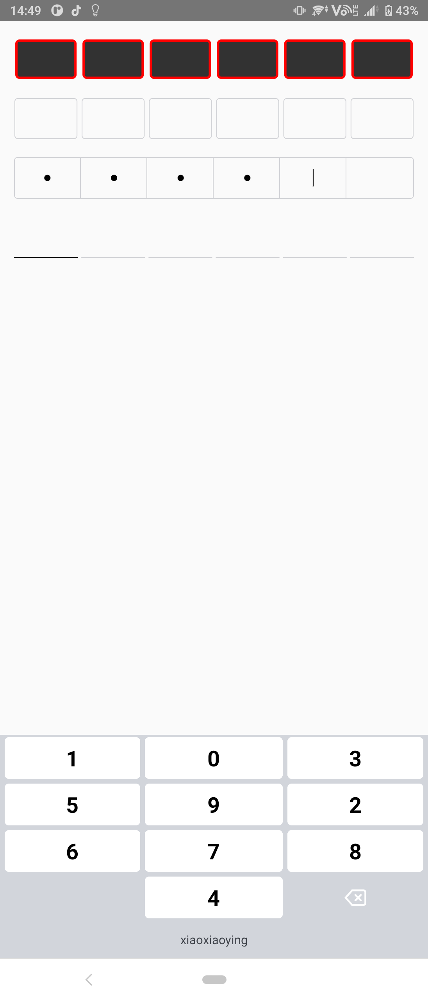

#### PwdView / KeyboardView

###### PwdView 使用

```xml

<com.xiaoxiaoying.pwdview.widget.PasswordEditText android:id="@+id/passwordEditText"
    android:layout_width="match_parent" android:layout_height="48dp"
    android:layout_marginHorizontal="16dp" android:layout_marginTop="20dp"
    app:keyboard_type="custom" app:interval="0dp" app:layout_constraintTop_toTopOf="parent"
    app:passwordNumber="6" />

```

| 属性                    | 注释                                                                         |
|-----------------------|----------------------------------------------------------------------------|
| passwordNumber        | 密码位数                                                                       |
| interval              | 密码间隔                                                                       |
| keyboard_type         | 键盘类型: 1、custom 自定义键盘； 2、system 使用系统键盘                                      |
| passwordRadius        | 密码圆点半径                                                                     |
| passwordColor         | 密码圆点颜色                                                                     |
| errorColor            | 密码错误颜色                                                                     |
| divisionLineColor     | 分割线颜色                                                                      |
| divisionLineSize      | 分割线大小(特指宽度)                                                                |
| backgroundBorderColor | 背景边框颜色                                                                     |
| backgroundBorderSize  | 背景边框大小                                                                     |
| cursorColor           | 光标颜色                                                                       |
| backgroundColor       | 背景颜色                                                                       |
| bgCorner              | 背景圆角                                                                       |
| input_type            | 输入类型 1、password（密码类型）；2、number（数字）(如果键盘为自定义键盘起作用，使用系统键盘则使用正常的EditText属性即可) |
| model                 | 边框类型，1、dialog 2、activity（只有底部有线）                                           |
| pwd_type              | 密码类型，1、origin （•） 2、star （*）                                               |

###### KeyboardView 使用

```xml

<com.xiaoxiaoying.pwdview.widget.CustomKeyboardView android:id="@+id/keyboard"
    android:layout_width="match_parent" android:layout_height="wrap_content"
    app:deleteColor="#FF0000" app:itemTextColor="#FF0000"
    app:layout_constraintBottom_toBottomOf="parent" />

```

| 属性              | 注释                      |
|-----------------|-------------------------|
| isSoundEffects  | 是否开启声音                  |
| isVibrate       | 是否开启震动                  |
| sortType        | 排序类型 1、insanity 2、order |
| hintText        | 键盘底部提示文案                |
| hintTextColor   | 键盘底部提示文案颜色              |
| hintTextSize    | 键盘底部提示文案大小              |
| backgroundColor | 键盘背景颜色                  |
| itemBackground  | 数字键背景                   |
| itemTextColor   | 数字键颜色                   |
| itemTextSize    | 数字键大小                   |
| deleteColor     | 删除键颜色                   |
| deleteDrawable  | 删除按钮图片                  |
 



```kotlin
maven { url = uri("https://jitpack.io") }
implementation "com.github.xiaoxiaoying:PwdView:1.0.4"
```
